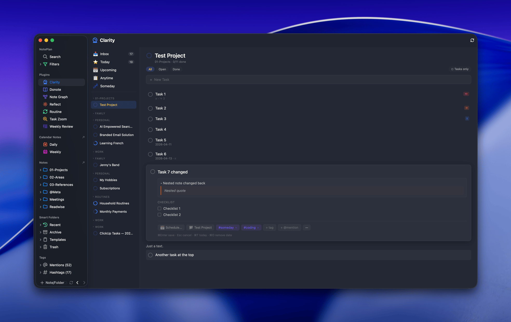

# Clarity for NotePlan

A Things 3-inspired task clarity layer for [NotePlan](https://noteplan.co). Surfaces tasks from across your notes into smart views, provides inline task editing, and shows projects/areas in a collapsible sidebar.



## Features

### Smart Views

- **Inbox** — Tasks living in past and today's daily notes, grouped by date. Your capture inbox, ready for triage.
- **Today** — Tasks scheduled for today + overdue. Grouped by note, folder, or priority. Overdue tasks highlighted in red.
- **Upcoming** — Future-scheduled tasks on a date timeline. Day-scheduled and week-scheduled shown separately.
- **Anytime** — All available tasks (not someday, not future-scheduled). Yellow star marks today-scheduled tasks. `Cmd+T` to schedule for today, `Cmd+O` to unschedule.
- **Someday** — Tasks tagged `#someday`, slightly dimmed. Scheduling a task auto-removes the tag.

Task deduplication in Today/Upcoming views via NotePlan block IDs (`^abc123`).

### Sidebar

- Smart view navigation with task count badges (Inbox, Today)
- Collapsible areas grouped by folder path — click to expand/collapse
- Project progress rings showing completion percentage
- Ring color from note's `bg-color-dark` frontmatter property, defaulting to blue
- Collapsed state persisted across sessions
- Notes with `type: project` or `type: area` in frontmatter shown even without tasks

### Inline Task Editor

Double-click any task (or press Enter) to expand it inline:

- **View/edit mode** — opens in view mode with rendered markdown; Tab or click to enter edit mode
- Edit task title and notes, with Tab cycling between them
- Nested notes shown with proper formatting (bullets, blockquotes)
- Toggle checklist items (Things-style square checkboxes)
- Schedule via date picker (quick options + mini calendar + week scheduling)
- Move to another note via searchable note picker
- Add/remove tags and mentions via inline input
- Cycle priority (none / ! / !! / !!!)
- Trailing tags stripped from title (shown only in metadata bar, re-appended on save)
- Children indicators on task rows: notes, checklist progress, sub-task count
- `Cmd+Enter` to save, `Esc` to cancel

### Note/Project View

Click any project in the sidebar to view it:

- Donote-style rendering: headings, prose, tasks, lists, and blockquotes intertwined naturally
- Filter by status (All / Open / Done)
- "Tasks only" toggle hides prose, keeps headings as section dividers
- Nested content (notes, checklists) hidden under parent tasks, shown in expanded editor
- Click the project title to open the note in NotePlan's split view editor
- Quick-add creates tasks directly in the viewed note

### Inline Markdown Rendering

- Bold, italic, strikethrough, highlights
- Wiki links (`[[Note Name]]`) and web links (`[text](url)`)
- Bare URLs auto-linked
- Inline code (`` `code` ``)
- Tags and @mentions styled (with email-safe mention detection)
- Comments (`//` and `/* */`) rendered dimmed
- NotePlan block IDs (`^abc123`) shown as a subtle asterisk

### Task Creation

Quick-add input in every view. Press Enter to create:
- Inbox/Anytime: creates in today's daily note
- Today: creates with today's scheduled date
- Someday: creates with `#someday` tag
- Note view: creates in the currently viewed note

### Routine Plugin Integration

When completing a task with `@repeat`, Clarity automatically invokes the Routine plugin to generate the next repeat instance.

### Keyboard Shortcuts

| Shortcut | Action |
|----------|--------|
| `Arrow Up/Down` | Navigate between tasks |
| `Enter` | Expand focused task for editing |
| `Double-click` | Expand task for editing |
| `Space` | Toggle focused task checkbox |
| `Tab` | Cycle between title and notes fields |
| `Cmd+Enter` | Save expanded task |
| `Escape` | Close picker or collapse editor |
| `Cmd+T` | Schedule task for today |
| `Cmd+O` | Remove scheduled date |
| `Cmd+N` | Focus quick-add input |

### State Persistence

- Last viewed smart view or project restored on reload
- Sidebar collapsed areas remembered across sessions
- All settings persisted via NotePlan's DataStore

## Architecture

Clarity uses a **WebView SPA** architecture for a snappy, responsive UI:

- **script.js** — Data layer. Queries NotePlan API for tasks and notes, handles all mutations (toggle, save, move, create), sends JSON data to the WebView.
- **clarityEvents.js** — Presentation layer. Manages UI state, renders all views, handles filtering/grouping/keyboard shortcuts locally. Only calls back to the plugin for data mutations.
- **clarity.css** — All styling. Theme-adaptive via CSS custom properties extracted from NotePlan's current theme. Supports dark and light modes.

View switching and filtering is instant (no plugin round-trip). Only mutations (checkbox toggle, task save/move) communicate with the plugin.

## Installation

1. Copy the `asktru.Clarity` folder into your NotePlan plugins directory:
   ```
   ~/Library/Containers/co.noteplan.NotePlan-setapp/Data/Library/Application Support/co.noteplan.NotePlan-setapp/Plugins/
   ```
   (Adjust path for non-Setapp installations)

2. Ensure `np.Shared` plugin is installed (provides FontAwesome icons and the communication bridge)

3. Restart NotePlan or run the "Clarity" command from the Command Bar

## Settings

| Setting | Default | Description |
|---------|---------|-------------|
| Inbox Lookback Days | 14 | How far back to scan daily notes for inbox tasks |
| Excluded Folders | _(empty)_ | Comma-separated folder names to skip when scanning |

## Requirements

- NotePlan 3.9.0+
- macOS 10.13+
- `np.Shared` plugin

## License

MIT
