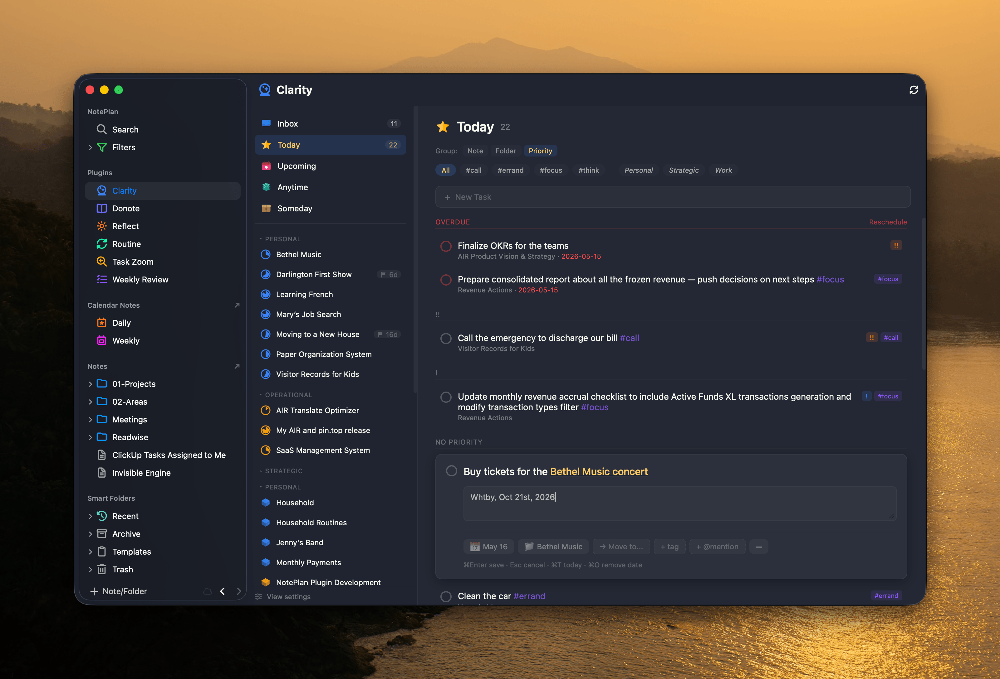

# Clarity for NotePlan

A Things 3-inspired task clarity layer for [NotePlan](https://noteplan.co). Surfaces tasks from across your notes into smart views, provides inline task editing, and shows projects/areas in a collapsible sidebar.



## Features

### Smart Views

- **Inbox** — Tasks living in past and today's daily notes, grouped by date. Your capture inbox, ready for triage.
- **Today** — Tasks scheduled for today + overdue, grouped by note/folder/priority. Overdue highlighted in red. A separate **This Evening** section lists tasks tagged `#evening` (use `Cmd+E` to add).
- **Upcoming** — Future-scheduled tasks on a date timeline. Day-scheduled and week-scheduled shown separately.
- **Anytime** — All available tasks (not someday, not future-scheduled). Yellow star marks today-scheduled tasks.
- **Someday** — Tasks tagged `#someday`, plus paused and someday projects/areas (which would otherwise be hidden from the sidebar).

Task deduplication in Today/Upcoming via NotePlan block IDs (`^abc123`).

### Sidebar

- Built-in views (Inbox, Today, Upcoming, Anytime, Someday) with task-count badges for Inbox + Today
- Collapsible folders containing project/area notes — click the chevron to expand/collapse
- **Project progress rings** colored from the note's `bg-color-dark` frontmatter (defaults to blue)
- **Area icons** rendered as isometric tinted cubes
- **Status overlays** — paused (bars), completed (check), canceled (×)
- **Amber recolor** + footer when a project/area is overdue for review (see Review Cadence)
- **Deadline flag** badges showing days-until on rows with a `due:` frontmatter date
- Sidebar footer **settings popover**: hide notes without open tasks · hide non-projects/areas · hide paused · per-view visibility toggles · collapse / expand all
- **Resizable**: drag the divider between sidebar and main pane; width persists

### Inline Task Editor

Double-click a task (or press Enter on the focused row) to expand it inline:

- **View / edit mode** — opens in view mode with rendered markdown; click a field or press Tab to edit
- Edit title and notes; Tab cycles between them
- Toggle checklist children (square checkboxes)
- Date picker: quick options (Today / Tomorrow / Next Monday / In a week) + mini calendar + Week tab
- Note picker: searchable, folder-grouped list to move the task to another note
- Inline autocomplete when adding tags (`#`) or mentions (`@`)
- Cycle priority none → `!` → `!!` → `!!!`
- Children indicators on collapsed rows: notes (`≡`), checklist progress (`☑ done/total`), sub-task count (`⤷ n`)
- `Cmd+Enter` to save, `Esc` to cancel, `Cmd+Backspace` to delete (with confirmation)

### Note / Project View

Click a project in the sidebar to open it inline:

- Document-style rendering: headings, prose, tasks, lists, blockquotes, markdown tables — intertwined
- Filter pills: All / Open / Done · "Tasks only" toggle hides prose, keeps headings as section dividers
- Drag-and-drop to reorder tasks (long-press, ⌘E ESC to cancel)
- Collapse / expand markdown sections via heading chevrons (matches NotePlan's `…` convention)
- Project actions menu (⋯): **Refresh** · **Edit metadata…** · **Move completed to bottom** · **Move to archive…**
- Click the project title to open the underlying note in NotePlan's split-view editor
- Quick-add creates tasks directly in the viewed project

### Clarity View Options (opt-in)

Each project note can opt into extra UI affordances via a single `clarity:` front-matter key with a comma-separated list of tokens. All four are off by default and configurable from the metadata modal as chip toggles:

- `toc` — Table of contents in a right sidebar. Only renders when the note has at least one subheading. Click an entry to smooth-scroll the note; the entry under the viewport top gets highlighted as you scroll.
- `indent` — Colors headings (H1 gold, H2 blue, H3 orange, H4 green) and indents each section body by 20px per level, so deeply-structured project notes get a visible hierarchy.
- `focus` — Adds an eye icon to each heading. Clicking it dims the rest of the note to 22% opacity so you can concentrate on one section. Multiple sections can be focused simultaneously. State persists on disk via a trailing `👀` marker on the heading and is shared with the Donote plugin.
- `progress` — Shows a Things-3-style pie indicator on every heading that contains tasks, summing tasks across the whole section (so an H1 pie reflects completion of everything beneath it). Cancelled tasks are excluded.

Example front matter:

```yaml
---
title: Q3 Plan
clarity: toc, indent, progress
---
```

### Project / Area Metadata

The **Edit metadata…** dialog edits the note's frontmatter directly:

- **Type**: project / area / —
- **Status**: active / paused / someday / completed / canceled (last two project-only)
- **Deadline** date
- **Last Review** (one-click "Mark as reviewed")
- **Review Schedule** in `1d` / `1w` / `2w` / `1m` / `1q` / `1y` form

### Review Cadence

When a `review:` schedule is set on a project/area, Clarity tracks when the next review is due based on the last `reviewed:` date. Notes that are due (or overdue) get an **amber accent** in the sidebar and a footer banner in the project view with a one-click "Mark as Reviewed" button. Logic mirrors the `asktru.WeeklyReview` plugin.

### Quick-Jump Palette

`Cmd+/` opens a Cmd-K-style palette to jump to any project or area. Empty query shows your most recently visited notes first. Ranks by substring + first-letter-of-each-word match (so `ehs` finds "Eat Healthy Stuff").

### Inline Markdown Rendering

Bold, italic, strikethrough, highlights · wiki and web links · bare URLs · inline code · tags / `@mentions` (Unicode-aware, accepts non-ASCII letters) · `//` and `/* */` comments dimmed · block IDs (`^abc123`) shown as a subtle asterisk.

### Task Creation

Quick-add input in every view. Press Enter to create:

- **Inbox / Anytime** → today's daily note
- **Today** → today's daily note, scheduled for today
- **Someday** → today's daily note, tagged `#someday`
- **Note view** → prepended to the viewed project

### Routine Plugin Integration

When completing a task with `@repeat(...)`, Clarity invokes the Routine plugin to generate the next repeat instance.

### Keyboard Shortcuts

| Shortcut | Action |
|----------|--------|
| `↑` / `↓` | Move focus between tasks |
| `⌘⌃↑` / `⌘⌃↓` | Move the focused task up / down (note view) |
| `Enter` (or double-click) | Open the focused task |
| `Space` | Toggle the focused task done / open |
| `Esc` | Close editor, picker, or palette |
| `?` | Show the cheatsheet |
| `Cmd+1`..`Cmd+5` | Switch view (Inbox / Today / Upcoming / Anytime / Someday) |
| `Cmd+/` | Quick-jump to a project or area |
| `Cmd+N` | Focus the New Task input |
| `⌘⌃N` | New task below the focused task (note view) |
| `⌘⇧N` | New heading below the focused task (note view) |
| `⌘⌥N` | New project note in the current folder (note view) |
| `Cmd+T` | Schedule the focused or open task for today |
| `Cmd+Shift+T` | Schedule for tomorrow |
| `Cmd+E` | Add to "This Evening" |
| `Cmd+O` | Clear the schedule |
| `Cmd+Enter` | Save the open task editor |
| `Cmd+⌫` | Delete task (with confirmation) |
| `Tab` (in editor) | Cycle between title and notes |

### Commands

| Command | Description |
|---------|-------------|
| **Open in sidebar** (alias `clarity`) | Open the Clarity dashboard in the sidebar |
| **Open in separate window** | Open the Clarity dashboard in a floating window |
| **Open current note in sidebar** (alias `show in clarity`) | Open the current note as a project view in the sidebar |
| **Open current note in separate window** | Open the current note as a project view in a floating window |

### State Persistence

Last view, last project, sidebar width, collapsed folders, recents list, per-view preferences (filters, grouping, "tasks only"), and the visibility / hide-paused / hide-empty / hide-non-project toggles are all persisted via NotePlan's `DataStore`.

## Architecture

Clarity is a **WebView SPA**: the plugin side queries the NotePlan API and pushes JSON to the webview; the webview owns rendering, filtering, grouping, and editor state, and only round-trips back to the plugin for actual mutations.

The webview source lives in `src/webview/` and is bundled into `clarityEvents.js` by esbuild.

```
src/webview/
  index.js init.js keyboard.js state.js messages.js
  lib/   helpers.js  markdown.js  review.js  icons.js
         task-categorization.js
  ui/    sidebar.js  views.js  task-list.js  task-editor.js
         pickers.js  modals.js  quick-jump.js  dnd.js
```

| File | Role |
|------|------|
| `script.js` | Plugin-side. NotePlan API access, frontmatter parsing, task mutations. |
| `clarityEvents.js` | Bundled webview output. Loaded into the HTML window; do not edit by hand. |
| `clarity.css` | Theme-adaptive styling, dark + light. |

Run `npm run build` after editing anything under `src/webview/`. `npm run watch` rebuilds on save.

## Installation

1. Copy the `asktru.Clarity` folder into your NotePlan plugins directory:
   ```
   ~/Library/Containers/co.noteplan.NotePlan-setapp/Data/Library/Application Support/co.noteplan.NotePlan-setapp/Plugins/
   ```
   (Adjust path for non-Setapp installations.)
2. Ensure `np.Shared` is installed (FontAwesome icons + comms bridge).
3. Restart NotePlan or run the **Open in sidebar** command (alias `clarity`).

## Settings

| Setting | Default | Description |
|---------|---------|-------------|
| Inbox Lookback Days | 14 | How far back to scan daily notes for inbox tasks |
| Excluded Folders | _(empty)_ | Comma-separated folder names to skip (in addition to `@Archive`, `@Trash`, `@Templates`) |

Visibility toggles (hide paused / hide non-projects / hide empty), per-view visibility, sidebar width, and collapsed folder state are managed from the sidebar footer settings popover rather than the Settings sheet.

## Requirements

- NotePlan 3.9.0+
- macOS 10.13+
- `np.Shared` plugin

## License

MIT
